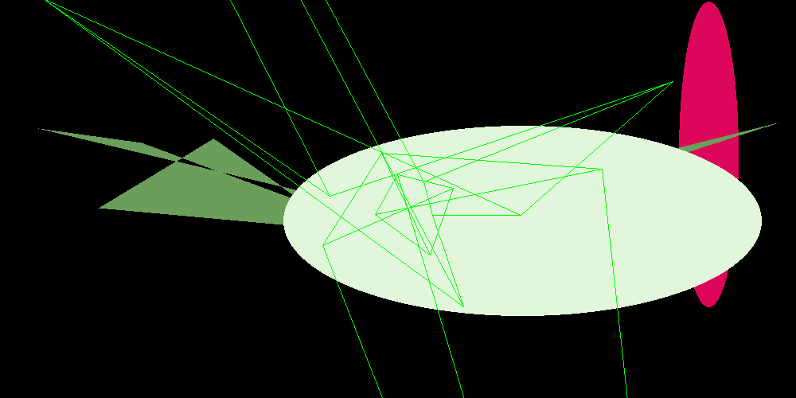

# Random Crazy GIF Generator 

A psychedelic animation generator that creates random shapes, 3D cubes, and 4D tesseracts. Displays directly in your terminal or exports as GIF!


|| 
|--------------------|

## Features ✨

- 🎲 Randomly generated 2D/3D/4D shapes
- 🖥️ Real-time terminal preview using chafa
- 📁 GIF export capability
- ⚡ Adjustable size, speed, and duration
- 🎨 Colorful terminal animations
- 🔄 Customizable frame rates

## Installation 📦

**Recommended:** Install using `uv` for faster dependency resolution:

```bash
# Install uv
curl -LsSf https://astral.sh/uv/install.sh | sh
```
**1. Install System Dependencies:**

```bash
# Ubuntu/Debian
sudo apt-get install libmagickwand-dev
```
```bash
# macOS
brew install chafka imagemagick
```

## Usage 🚀
```bash
# Display animation in terminal (default)
uv run random_gif.py --size 80 --frames 20 --speed 1.5
```
```bash
# Generate GIF file
uv run random_gif.py --output trippy.gif --size 100 --frames 30 --speed 0.8
```

## Options ⚙️

| Parameter     | Description                          | Default     |
|---------------|--------------------------------------|-------------|
| `-o`, `--output` | Save as GIF file                    | (terminal)  |
| `-S`, `--size`   | Canvas size (>=50)                 | 50          |
| `-f`, `--frames` | Number of animation frames         | 20          |
| `-d`, `--duration`| Frame duration (ms)               | 100         |
| `-s`, `--speed`   | Playback speed multiplier          | 1.0         |


**Slow-mo fractal journey:**
```bash
python random_gif.py --speed 0.5 --frames 100
```

## Technical Notes 🔧

- Uses `chafa.py` for terminal rendering ([docs](https://github.com/GuardKenzie/chafa.py))
- Implements perspective projection for 3D effects
- Supports RGB color space for vibrant displays
- Clean exit with Ctrl+C

> **Pro Tip:** For best results, use a terminal with true color support!
```

Key improvements from your initial version:
1. Added badges and visual elements
2. Organized installation instructions with code blocks
3. Created clear parameter table
4. Added multiple usage examples
5. Included technical details section
6. Added pro tips and system package notes
7. Improved overall structure with emoji visual cues
8. Added proper chafa documentation reference

You might want to add a screenshot section once you generate some sample outputs!
